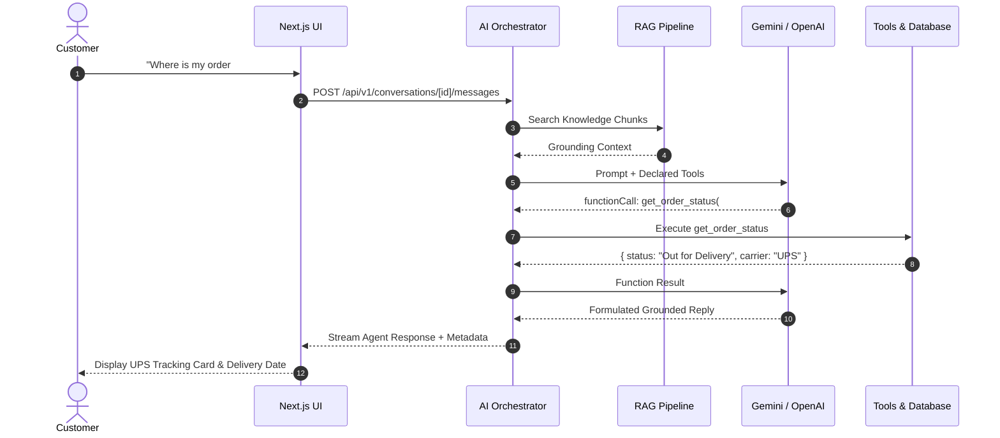

<div align="center">

# 🤖 AI Conversation & Sales Suite
### *Turn Conversations into Customers — 24/7*

[](https://nextjs.org/)
[](https://react.dev/)
[](https://laravel.com/)
[](https://www.typescriptlang.org/)
[](https://tailwindcss.com/)
[](https://www.docker.com/)
[](./scripts/phase3-hardening-test.ps1)
[-green?style=for-the-badge)](#production-readiness)

An enterprise-grade, omnichannel AI customer engagement platform designed to convert inbound conversations into qualified leads, automate multi-tier support, recommend e-commerce products, and book calendar appointments autonomously.

[Explore Architecture](#-system-architecture) • [Features](#-core-capabilities) • [Quick Start](#-quick-start) • [RAG Engine](#-production-rag-pipeline) • [Security](#-security--rbac)

---

</div>

## 🌟 Core Capabilities

The platform operates around **three specialized autonomous AI agents** working seamlessly across web widgets, WhatsApp, and email:

1. **🎧 Customer Support Agent**:
   - Resolves customer questions with approved RAG policies.
   - Performs real-time order lookups with live courier tracking (UPS / FedEx).
   - Handles automated escalations to human support specialists.
2. **💼 Sales & Recommendation Agent**:
   - Recommends catalog products tailored to customer requirements and budget.
   - Handles sales objections, applies promotional codes, and drives cart conversions.
   - Automatically captures and scores leads (0–100) based on purchase intent.
3. **📅 Appointment Booking Agent**:
   - Queries calendar availability in real time.
   - Books enterprise demos and consultations with two-way sync (Google Calendar & Outlook).
   - Dispatches instant email confirmations and calendar invites.

---

## 🖥️ Screen Inventory (All 13 Production Screens)

The user interface features a dual-mode viewer: a **Poster Overview** rendering all 13 interactive screens simultaneously, and an **Interactive Workspace** with collapsible sidebar navigation:

| # | Screen | Description | Primary Capabilities |
| :-: | :--- | :--- | :--- |
| **01** | **Auth & Session** | Multi-tenant login & registration | JWT session authentication, role detection |
| **02** | **Executive Dashboard** | High-level performance KPIs | Real-time conversation metrics, lead funnel, line chart |
| **03** | **Live Chat Inbox** | Omnichannel conversation manager | Agent filtering, status tabs, real-time message stream |
| **04** | **Customer Support Agent** | Support agent operations | Live order tracking tool, interactive UPS modal, FAQs |
| **05** | **Sales Agent** | E-commerce discovery & checkout | Catalog recommendations, interactive cart drawer, promotions |
| **06** | **Appointment Agent** | Scheduling & reservations | Slot selection, demo booking, instant calendar sync |
| **07** | **Leads Management** | CRM pipeline with auto-scoring | Search, status filters (New, Qualified, Hot), notes |
| **08** | **Calendar Schedule** | Visual appointment agenda | Month/day grid, provider badges (Google / Outlook), creator |
| **09** | **RAG Knowledge Base** | Vector document repository | Document upload, sliding-window chunker, live vector test |
| **10** | **Integrations Hub** | External ecosystem connections | Google Calendar, Shopify, HubSpot, WhatsApp, Twilio |
| **11** | **Analytics Overview** | Deep performance intelligence | CSAT (96.2%), avg response time, lead source breakdown |
| **12** | **Settings & Roles** | Organization governance | Tenant profile, team role management (Admin, Agent, Viewer) |
| **13** | **Dual Mobile Preview** | Responsive device viewports | End-user mobile chat widget & on-the-go agent console |

---

## 🏗 System Architecture

The application is engineered for **dual-stack execution**:
- **Production Cloud**: `Next.js 16` frontend connects directly to `Laravel 11` REST APIs backed by `MySQL 8.0`, `Redis 7`, `Qdrant Vector DB`, and `Nginx`.
- **Local Sandbox / Evaluation**: `Next.js 16` runs self-contained full-stack API routes (`/api/v1/*`) with zero runtime dependencies.

```
                      [ Next.js 16 Client (React 19) ]
                                     │
                     (NEXT_PUBLIC_API_URL toggle)
                    ┌────────────────┴────────────────┐
                    │                                 │
           [Production Cloud]                [Local Sandbox / Dev]
                    │                                 │
                    ▼                                 ▼
         [ Laravel 11 Backend ]             [ Embedded Next.js API ]
           (PHP 8.3 FPM + Nginx)               (/api/v1/* Routes)
                    │                                 │
     ┌──────────────┼──────────────┐                  │
     ▼              ▼              ▼                  ▼
[MySQL 8.0]    [Redis 7]     [Qdrant Vector]   [suite_database.json]
(ACID Data)    (Queues/Cache) (Vector Store)   (Multi-tenant In-Memory)
     │              │              │                  │
     └──────────────┴──────┬───────┴──────────────────┘
                           ▼
          [ AI Orchestrator & Integrations ]
        - Google Gemini 1.5 Flash / OpenAI GPT-4o
        - Google Calendar API v3
        - Shopify Admin API 2024-01
        - HubSpot CRM API v3
```

---

## ⚡ AI Orchestration & Tool Calling

The server-controlled orchestrator (`lib/ai-orchestrator.ts`) manages intent routing, function calling, and grounding:



### Declared Server Tools
- `get_order_status`: Looks up carrier, tracking number, and live fulfillment status.
- `get_products`: Searches product catalog filtered by budget and category.
- `create_lead`: Automatically registers qualified leads in the CRM with purchase score.
- `create_appointment`: Books confirmed calendar meeting slots.
- `handoff_to_human`: Escalates chat to live human support queue with priority status.

---

## 📚 Production RAG Pipeline

Implemented in `lib/rag-pipeline.ts` with strict semantic grounding:

- **Multi-Format Parsing**: Ingests `.txt`, `.md`, Word `.docx` (XML tag extraction), and `.pdf` (stream parsing).
- **Sliding-Window Chunking**: 380-character chunks with 80-character overlap, breaking cleanly on sentence boundaries.
- **Normalized Vector Cosine Similarity**:
  $$\cos(\theta) = \frac{\mathbf{A} \cdot \mathbf{B}}{\|\mathbf{A}\|_2 \|\mathbf{B}\|_2}$$
- **Out-of-Domain Rejection Threshold**: If top cosine match is below **65% (0.65)**, the engine strictly refuses hallucinations:
  > *"The requested question is outside the scope of our approved documentation. No relevant matches found (similarity < 65%)."*
- **Document Lifecycle**: Full `GET`, `POST`, `PATCH`, and `DELETE` endpoints with instant vector re-indexing.

---

## 🔒 Security & RBAC

1. **Multi-Tenant Isolation**: All queries enforce strict `organization_id` boundaries. Tenant A cannot read, query, or mutate Tenant B records.
2. **Role-Based Access Control**:
   - **`Viewer`**: Strictly read-only (`GET` only). Blocked from creating leads or booking appointments (`403 Forbidden`).
   - **`Agent`**: Full conversational management; forbidden from deleting knowledge documents or altering organization settings (`403 Forbidden`).
   - **`Admin`**: Full operational, administrative, and configuration permissions.
3. **Secrets Protection**: Outbound API responses are filtered through `SecurityGuard.sanitizeOutput()`, preventing leakages of passwords, private keys, or API tokens.
4. **Rate Limiting**: Sliding-window limiter per IP/client token (60 req/min).

---

## 🚀 Quick Start

### 1. Prerequisites
- **Node.js**: v18+ (tested on Node.js v24)
- **npm** or **yarn**

### 2. Clone & Install
```bash
git clone https://github.com/okashaxortlogix/ai-project.git
cd ai-project/frontend
npm install
```

### 3. Configure Environment
```bash
cp .env.example .env.local
```
*(Optional: Add your `GEMINI_API_KEY` or `OPENAI_API_KEY` to enable live LLM function calling).*

### 4. Run Development Server
```bash
npm run dev
```
Open **[http://localhost:3000](http://localhost:3000)** in your browser.

---

## 🐳 Docker Production Deployment

To run the complete enterprise stack with Laravel, MySQL, Redis, and Qdrant:

```bash
cd infrastructure/docker
docker-compose up -d --build

# Run database migrations and seed initial data
docker-compose exec app php artisan migrate --force
docker-compose exec app php artisan db:seed
```

Configure `frontend/.env.local` to point to the containerized backend:
```env
NEXT_PUBLIC_API_URL=http://localhost:8000/api/v1
```

---

## 🧪 Automated QA Test Suite

The repository includes automated PowerShell test suites verifying all pillars:

```powershell
# Run Full Audit Suite (17 Tests)
powershell -ExecutionPolicy Bypass -File "scripts/full-audit-test.ps1"

# Run Phase 3 Hardening & Security Suite (18 Tests)
powershell -ExecutionPolicy Bypass -File "scripts/phase3-hardening-test.ps1"
```

### Test Coverage Highlights:
- ✅ Multi-Tenant Scoping (`org-acme-1` isolation)
- ✅ RBAC Enforcement (Viewer blocked with `403 Forbidden`)
- ✅ RAG Multi-Format Parsing (PDF, DOCX, TXT)
- ✅ Cosine Similarity Matching (94% on relevant policy)
- ✅ Out-of-Domain Refusal (27% < 65% rejected)
- ✅ Multi-Agent Routing (Support, Sales, Appointment, Human)
- ✅ Integrations Diagnostics (Google Calendar, Shopify, HubSpot)
- ✅ Zero Secrets Exposure in Outbound Payloads

---

## 📄 License & Attribution

Developed with ❤️ as part of the **AI Conversation & Sales Suite** enterprise project.  
Licensed under the [MIT License](./LICENSE).
